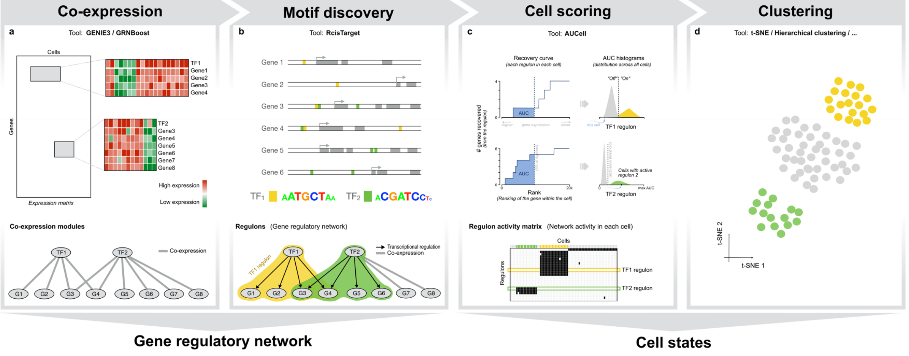

## 一、SCENIC简介

SCENIC，Single-cell rEgulatory Network Inference and Clustering，专为单细胞数据开发的GRNs算法，旨在识别高可靠性的由转录因子主导的的GRNs。

#### 1. 提出的生物学背景

组织内`细胞异质性`的基础是`细胞转录状态`的差异，转录状态的特异性又是由`转录因子主导的基因调控网络`GRNs决定并维持稳定的。

#### 2. 提出的组学背景

单细胞转录组数据具有`背景噪音高`、`基因检出率低`和`表达矩阵稀疏性`的特点，给传统的统计学和生物信息学方法`推断高质量的GRNs`带来了挑战。

#### 3. SCENIC优势

专为单细胞数据开发的GRNs算法，创新之处在于`引入了转录因子motif序列验证统计学方法推断的基因共表达网络`。旨在识别高可靠性的由转录因子主导的的GRNs。

## 二、SCENIC工作流程概览

|                            | **步骤**  | **包基础**                           | **输入数据** | **算法核心** | **输出数据** | **完成任务**                                                                 | 涉及概念        |
|----------------------------|-----------|--------------------------------------|--------------|--------------|--------------|------------------------------------------------------------------------------|-----------------|
| 核心步骤------数据分析处理 | **Step1** | GENIE3/GRNBoost                      | 表达矩阵     |              |              | 以TF为出发点，基于共表达情况鉴定每个TF的`潜在靶点`                           | module/network/ |
| 核心步骤------数据分析处理 | **Step2** | RcisTarget                           |              |              |              | 基于DNA-motif分析选择`潜在的直接结合靶点`                                    | regulon         |
| 核心步骤------数据分析处理 | **Step3** | AUCell                               |              |              | AUC          | 通过打分评估细胞内不同转录因子的调控活性；或者说分析每个细胞的`regulons活性` |                 |
| 数据探索和可视化           | **Step4** | t-SNE/Hierarchical clustering/...... |              |              |              | 基于regulons的活性鉴定`稳定的细胞状态`并对结果进行探索                       |                 |

## 三、参考资料

想要深入了解分析原理和流程，可以参考以下两篇文献：

I.  SCENIC : single-cell regulatory network inference and clustering （2007年首先发表于nature methods）

II. A scalable SCENIC workflow for single-cell gene regulatory network analysis (2020年将重新整理后的流程发表于nature protocles)

III. 优秀教程：[单细胞转录组高级分析二：转录调控网络分析 - 云+社区 - 腾讯云 (tencent.com)](https://cloud.tencent.com/developer/article/1692240)
