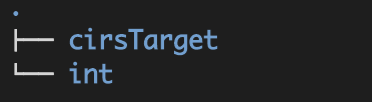
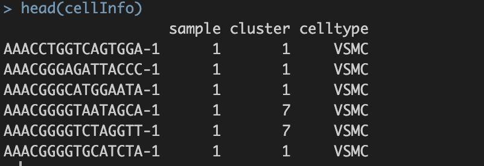
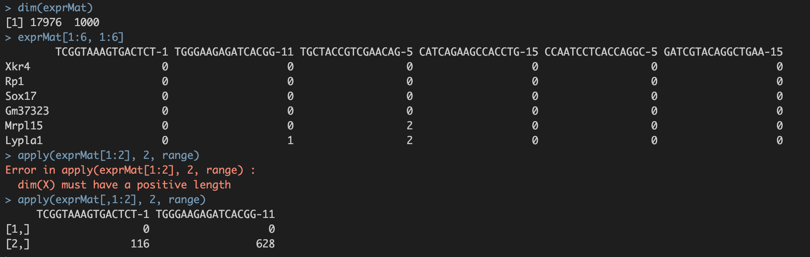
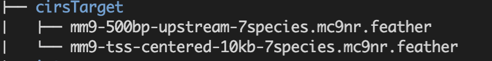

## 设置工作路径

创建新文件夹SCENIC，并将工作目录设置到./SCENIC/下。

## 准备工作目录



## 一、准备meta信息

meta信息主要是为了后续的数据挖掘与可视化，在共表达网络构建及细胞regulon评分过程不涉及该数据。

```{r eval=FALSE, include=TRUE}
## 准备meta信息
load("~/sce_all_celltype.RData")
DefaultAssay(sce) <- "RNA"
sce_used <- sce[,sce$celltype %in% c("Modulated SMC", "VSMC") & sce$genotype == "wt"]
cellInfo <- sce_used@meta.data
colnames(cellInfo)[which(colnames(cellInfo)=="orig.ident")] <- "sample"
colnames(cellInfo)[which(colnames(cellInfo)=="SCT_snn_res.0.5")] <- "cluster"
colnames(cellInfo)[which(colnames(cellInfo)=="celltype")] <- "celltype"
cellInfo <- cellInfo[,c("sample","cluster","celltype")]
save(cellInfo, file="int/cellInfo.RData")
```



## 二、准备表达矩阵

后续在共表达网络构建及细胞评分环节，有两个步骤非常占用计算资源。

测试流程时选用1000个细胞，runGenie3(exprMat_filtered_log, scenicOptions, nParts = 20) 耗时4个小时；runSCENIC_2\_createRegulons(scenicOptions) 耗时2.5小时。

表达矩阵数据类型： 1. 优先选择count矩阵，read count和UMI count均可。 2. TPM或FPKM或RPKM也可。尽管有的作者会担心使用校正后的数据会引入artificial 共表达关系，但是在SCENIC团队的测试中对结果无影响。【2007；natrue methods.】

```{r eval=FALSE, include=TRUE}
## 准备表达矩阵
#为了节省计算资源，随机抽取1000个细胞的数据子集。 # 实际数据分析中无需这个步骤
# subcell <- sample(colnames(sce_used),1000) 
# sce_used <- sce_used[,subcell]
#save(sce_used, file = "sce_for_SCENIC.RData")
exprMat <- as.matrix(sce_used@assays$RNA@counts)
saveRDS(exprMat, file="int/exprMat.RData")
```



## 三、准备数据库

#### 1. 数据下载路径

    1.1, For human:
    dbFiles <- c("https://resources.aertslab.org/cistarget/databases/homo_sapiens/hg19/refseq_r45/mc9nr/gene_based/hg19-500bp-upstream-7species.mc9nr.feather",
    "https://resources.aertslab.org/cistarget/databases/homo_sapiens/hg19/refseq_r45/mc9nr/gene_based/hg19-tss-centered-10kb-7species.mc9nr.feather")
    # mc9nr: Motif collection version 9: 24k motifs

    1.2, For mouse:
    dbFiles <- c("https://resources.aertslab.org/cistarget/databases/mus_musculus/mm9/refseq_r45/mc9nr/gene_based/mm9-500bp-upstream-7species.mc9nr.feather",
    "https://resources.aertslab.org/cistarget/databases/mus_musculus/mm9/refseq_r45/mc9nr/gene_based/mm9-tss-centered-10kb-7species.mc9nr.feather")
    # mc9nr: Motif collection version 9: 24k motifs

    1.3, For fly:
    dbFiles <- c("https://resources.aertslab.org/cistarget/databases/drosophila_melanogaster/dm6/flybase_r6.02/mc8nr/gene_based/dm6-5kb-upstream-full-tx-11species.mc8nr.feather")
    # mc8nr: Motif collection version 8: 20k motifs

#### 2. 下载方式

2.1 终端下载

将路径设置`"SCENIC/cirsTarget"`到在终端运行`wget -c 路径名`，下载相应的数据库文件。

2.2 Rstudio内下载

``` {.r}
{r eval=FALSE, include=TRUE}
# 将工作目录设置”/cirsTarget“。。。不要忘了将路径返回到“SCENIC”下哦。
#如果3个参考数据库都想下载，每次设置变量dbFiles后，都要运行以下代码
for(featherURL in dbFiles)
{
  download.file(featherURL, destfile=basename(featherURL)) # saved in current dir
}
```



## 四、设置分析环境

在数据分析之前，首先要配置好分析环境。主要涉及以下几个方面：

1.  org：注明使用的物种。有三个选择：
2.  nCores：使用的线程数，根据电脑CPU情况而定；
3.  dbDir：数据库存放目录，需要构建新的文件夹。此处为"`./SCENIC/cirsTarget`";
4.  dbs：数据文件的名称
5.  datasetTitle：随意就好。

因此，有三个参数的设置要非常重视：`org`, `dbDir`, `dbs`。【一定不能错哦！】

这三个参数相当于告诉计算机，从motif信息数据储存在cirsTarget文件夹下，名称为......。这样计算机就知道去哪里调用数据了。

```{r eval=FALSE, include=TRUE}
##设置分析环境
mydbDIR <- "./cirsTarget"
mydbs <- c("mm9-500bp-upstream-7species.mc9nr.feather",
           "mm9-tss-centered-10kb-7species.mc9nr.feather")
names(mydbs) <- c("500bp", "10kb")
scenicOptions <- initializeScenic(org="mgi", 
                                  nCores=8,
                                  dbDir=mydbDIR, 
                                  dbs = mydbs,
                                  datasetTitle = "first try")
save(scenicOptions, "int/scenicOptions.RData")
```

## 总结

这样，我们就准备好了后续分析使用的三个数据，并确保①`exprMat`和`cellInfo`数据格式正确；②database储存在正确路径下；③分析环境配置正确，并存储在`scenicOption`中，方便后续调用。
