GENIE3 package; 基因co-expression关系。 

## 一、代码

```{r eval=FALSE, include=TRUE}
##==转录调控网络推断==##
## 1.基因过滤
#过滤标准是基因表达量之和>细胞数*3%，且在1%的细胞中表达
genesKept <- geneFiltering(exprMat, scenicOptions, 
              minCountsPerGene = 3 * 0.01 * ncol(exprMat),  # 每个基因的最低count数
              minSamples = ncol(exprMat) * 0.01) # 至少在1%细胞内检测到
exprMat_filtered <- exprMat[genesKept, ]
## 2.计算相关性矩阵，并将结果保存值int目录下。
runCorrelation(exprMat_filtered, scenicOptions)
## 3. TF-Targets相关性回归分析,并将结果保存至int目录下。
exprMat_filtered_log <- log2(exprMat_filtered+1)
runGenie3(exprMat_filtered_log, scenicOptions, nParts = 20)
#这一步消耗的计算资源非常大，个人电脑需要几个小时的运行时间
## 4. 推断共表达模块
runSCENIC_1_coexNetwork2modules(scenicOptions)
```

## 二、分析过程解析

#### （一）输入数据

表达矩阵。【优先count矩阵（read count或UMI count均可）；TPM或FPKM/RPKM也可】

#### （二）数据分析处理环节及对应的实现方式：

1.  过滤低表达水平的基因。

    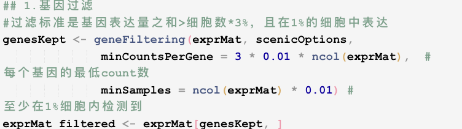

2.  计算相关性矩阵：所有基因对之间的`spearman correlation`。

    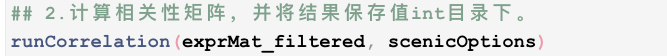

    并将结果储存至`./int/1.2_corMat.Rds`。数据内容如下：

    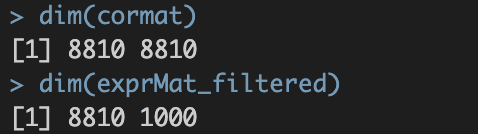

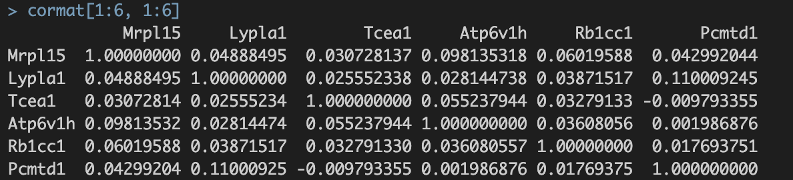

涉及8810个基因，8810个基因✖️8810个基因的speaman correaltion coefficient。

3.  调用GENIE3，进行TF-Targets相关性回归分析【核心步骤】。

    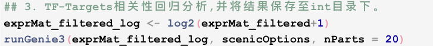并将最终结果保存至`./int/1.4_GENIE3_linkList.Rds`

    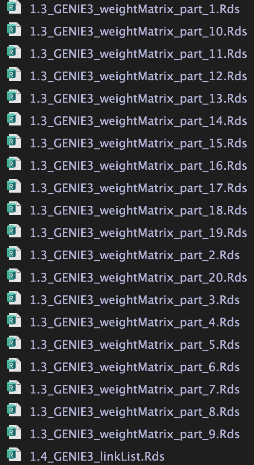

1.3 为中间输出结果，20个`.Rds`文件对应参数`nParts = 20`，相当于把表达矩阵拆成20个部分进行分析。

1.4 为1.3结果的整合。内容如下：

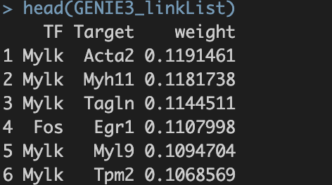

TF，转录因子名称；Target ------ 潜在靶基因的名字； weight ------TF与Target之间的`相关性权重`【这个概念需要重点理解】。

4.  将GENIE3/GRNBoost结果转化为co-expression module.

    计算过程基于1.4文件的结果，即TF与每一个潜在target gene的相关性。处理过程涉及对低相关性共表达TF-target的过滤，作者尝试了多种策略，研究发现没有一种最佳策略，因此建议`6种过滤标准`均使用。（默认使用6种方法）。6种方法分别为：

    ①`w001`：以每个TF为核心保留`weight>0.001`的基因形成共表达模块；

    ②`w005`：以每个TF为核心保留`weight>0.005`的基因形成共表达模块；

    ③`top50`：以每个TF为核心保留`weight值top50`的基因形成共表达模块；

    ④`top5perTarget`：每个基因保留weight值top5的TF得到精简的TF-Target关联表，然后把基因分配给TF构建共表达模块；

    ⑤`top10perTarget`：每个基因保留weight值top10的TF得到精简的TF-Target关联表，然后把基因分配给TF构建共表达模块；

    ⑥`top50perTarget`：每个基因保留weight值top50的TF得到精简的TF-Target关联表，然后把基因分配给TF构建共表达模块；

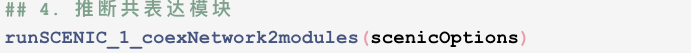

并将最终结果保存至`./int/1.6_tfModules_asDF.Rds`。数据内容如下：

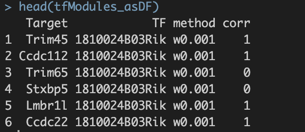

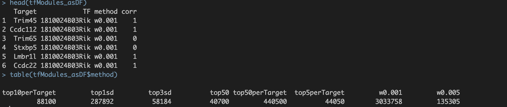

## 三、总结

以上运行结束后，会在SCENIC/int目录下生成以下rds格式数据。

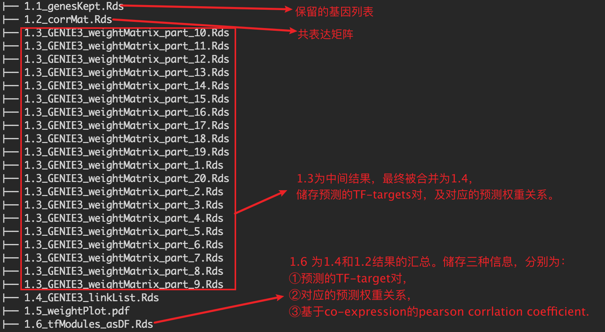{width="1200"}

第一步得到的final output: 1.6_tfModules_asDF.Rds 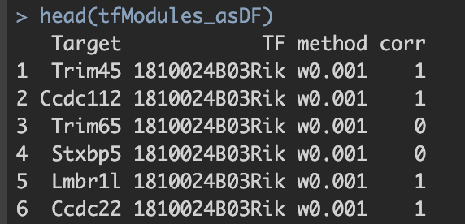 1. Target与TF：潜在的转录因子与靶基因对 2. method：筛选方法。六种筛选标准的解释见上。 3. corr：pearson correlation。 a. 基于基因的co-expression计算得出; b. 1.代表潜在激活效应；0代表无效应；-1代表潜在抑制效应。

小结：进入后续分析数据以"基因集"为单位进行分析。基因集的划分依据： 1. split by TF; 2. split by corr。 最终进入后续分析的基因集满足以下两个条件：1. 通过上述1-6种过滤标准后基因数仍\>20；2. corr =1。即只考虑TF共表达基因集。
