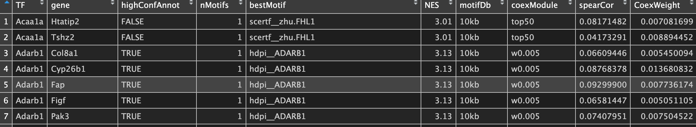

### 该分析环节简介

背景：经过上述分析每个转录因子都找到了强相关的靶基因，很多基因调控网络分析到此结束。但是这些基于共表达构建的强相关关系就代表一定存在靶向调控作用吗？SCENIC团队对此结果提出了质疑

目的：通过一定策略`修剪共表达模块`形成有生物学意义的`调控单元regulon`。

方法：借助RcisTarget包的算法。计算过程大致可以分为两步：

1\. 选择motifs。

该项分析依赖于`gene-motif评分（排行）数据库`，其行为基因、列为motif、值为排名。也就是我们下载的`cirsTarget`数据库，该数据库包含每个motif的全基因组范围的跨物种排名。

①motif富集分析

-   对于一个基因集，选择在该基因集内的所有基因的TSS周围显著over-represented的motifs。

-   实现算法：recovery-based method;

-   结果指标：NES 标准化的富集分数。

②motif的TF注释

-   注释结果分高、低可信度：

-   ①数据库`直接注释和同源基因推断`的TF是`高可信`结果；

-   ②使用`motif序列相似性`注释的TF是`低可信`结果。

筛选标准：①注释到相应的TFs；②富集分数＞3.0。满足以上两个条件的motif被保留。

小tip:
①脑中要有数据处理过程的图哦。。。。矩阵（行为基因，列为motif，值为排名）
→→→ 矩阵（行为regulon， 列为motif，值转化为NES值）→→→ 矩阵（行为regulon,
列为motif， 值为NES值及TF注释结果）→→→
保留value满足（NES和TF标准）的motif。②以每个细胞的每个潜在regulon为数据处理单元哦。。。

2\. 预测潜在的靶基因。

策略：
用保留的motif对共表达模块内的基因进行进行打分，识别显著高分的基因（理解为motif离这些基因的TSS很近）。

筛选过滤：删除共表达模块内与motif评分不高的基因，剩下的基因集则为调控单元regulon。

### 一、代码

```{r eval=FALSE, include=TRUE}
##推断转录调控网络（regulon）
runSCENIC_2_createRegulons(scenicOptions)
#以上代码可增加参数coexMethod=c("w001", "w005", "top50", "top5perTarget", "top10perTarget", "top50perTarget"))
#默认6种方法的共表达网络都计算，可以少选几种方法以减少计算量
```

注意：由于这一部涉及到对每个共表达模块的所有涉及motif的富集分析及TF注释，计算量非常大；且细胞数量越多，计算量越大。因此，为第一个耗时环节：1000个细胞耗时3-4h。

拓展------函数可选参数介绍

```{r eval=FALSE, include=TRUE}
runSCENIC_2_createRegulons(
  scenicOptions,
  minGenes = 20,    # 基因数量＞20的基因集纳入分析
  coexMethods = NULL,
  minJakkardInd = 0.8,   # 基于Jakkard index合并overlapping模块【减少计算量】
  signifGenesMethod = "aprox",
  onlyPositiveCorr = TRUE,  # 至纳入positive correlated targets。。。
  onlyBestGsPerMotif = TRUE
)
### 该函数通过进一步筛选基因列表、减少基因集数量等参数减少计算量，降低运行时间。
```

### 二、输出结果及解读

./int目录下的输出文件包括：


./output目录下的输出文件包括：


重点关注`./output`目录下的三个文件，储存结果对应分析过程中的`motif富集分析和注释`、`regulon确定`。

1.  motifenrichment_preview.html和MotifEnrichment.tsv展示的信息一致，前者为网页可视化版，后者为文本文件格式。均储存**`各个共表达模块显著富集的motif的注释信息`**。

    

-   geneSet：基因集的名字

-   motif：motif的ID

-   NES：基因集内的motif标准化的富集分数

-   AUC：曲线下面积，用于计算NES

-   TFinDB：标记highlighted
    TFs属于高可信度注释（\*\*）还是低可信度注释（\*）

-   TF_highConf：基于motifAnnot_highConfCat注释的TF

-   TF_lowConf: 基于motifAnnot_lowConfCat注释的TF

-   enrichedGenes：对于给定motif排名靠前的基因

-   nErnGenes：上述排名靠前基因的数量。

-   rankAtMax: Ranking at the maximum enrichment, used to determine the
    number of enriched genes.

2.  RegulonTargetsInfo.tsv是对上述信息的整合，但是以调控网络的形式组织数据。

    

-   TF：转录因子名称

-   gene：TF靶基因名称

-   nMotif：靶基因在数据库的motif数量

-   bestMotif：最显著富集的motif名称

-   NES：标准富集分数，分值越高越显著

-   highConfAnnot：是不是高可信注释

-   Genie3Weight：TF与靶基因的相关性权重

[***注意：该表示最重要的一个表。。。。后续筛选到感兴趣的regulon后，需要用到此表查询具体的TF和Targets信息。***]{.ul}

#### 知识拓展------regulon名称

regulon名称有两种形式，分别为：

①TF + 靶基因数量：TF与高可信靶基因（即highConfAnnot =
TRUE）的基因组成的基因调控网络

②TF + extended + 靶基因数目：TF与所有靶基因组成的基因调控网络

### 三、原理补充
