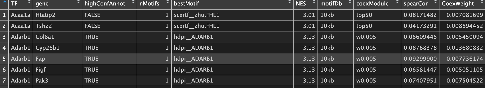

### 该分析环节简介

背景：以上分析已经获得了该细胞群所涉及的可信的regulons（TF-targets）。但是regulons可能涉及数百个(`length(table(regulonTargetsInfo$TF))#319`该分析涉及319个)。。。并不是所有的regulons都是我们感兴趣的，那么如何挑选出感兴趣的或者说与研究表型相关的regulons呢？

策略：以TF为出发点，即以基因集为单位，评估每个细胞的每个regulon的活性，获得regulon活性矩阵。

实现方法：基于AUCell包的算法，
一种识别具有活跃基因调控网络细胞的新方法。

①输入：gene set或regulon ②数据处理过程：基于recovery
analysis的打分方法。以"每个细胞的每个regulon"为分析单位。
③过程：对基因按照表达水平从高到底排序，统计每个表达值的基因数量，计算曲线下面积。
④输出：一个AUCscore的矩阵，储存每个细胞的每个regulon activity（AUC）。
结果：得到两个矩阵： ①一个AUC socre矩阵（绝对打分）； ②一个binary
矩阵（手动或自动设置阈值；标记on or off两个状态）

结果解读------AUC两层含义：
原则：评分的基础是基因的表达值，分数越高代表基因集的激活程度越高。
①绝对意义：代表签名基因集（regulon内位于高表达一端的基因子集）的基因占比。
②细胞内部比较：与同一个细胞内的其他regulon相比，该regulon的相对表达水平。
值越大，代表该regulon的targets 基因表达水平较高。
③细胞之间：对于同一个regulon的不同细胞，该regulon的相对表达水平。AUC值越大，代表该regulon在该细胞的活性越高。

数据挖掘方向：
①对细胞进行聚类。。。（直接将AUC矩阵视为连续性变量作为输入）。
②同一regulon在不同细胞的差异分析。。。（直接将AUC矩阵视为连续性变量作为输入）
③对于二元矩阵，可以热图可视化。。。

问题：
可不可以选择一个细胞内AUC值top10的regulon呢？即挑选基因表达水平较高的基因？
如何将regulon信息和基因的差异表达信息联合起来分析呢？

### 一、代码

说明：为了节约计算资源，推断regulon的时候随机筛选了1000个细胞。。。但是对细胞进行regulon评分的时候，可以针对所有的细胞。
原理：前面是推断regulon，本质是从细胞群中识别出重要的TF-Targets关系【1000个细胞推断的结果可能可靠，也可能不可靠哦】。
而评分的基础是基因表达值。

#### 1. regulon活性打分

```{r eval=FALSE, include=TRUE}
##==regulon活性评分与可视化==##
##regulons计算AUC值并进行下游分析
scenicOptions1 <- initializeScenic(org="mgi", 
                                  nCores=1,  # 这里不支持多线程，需要临时设置nCores = 1
                                  dbDir=mydbDIR, 
                                  dbs = mydbs,
                                  datasetTitle = "first try")  

exprMat_all <- exprMat
exprMat_all <- log2(exprMat_all+1)
runSCENIC_3_scoreCells(scenicOptions1, exprMat=exprMat_all)  
```

#### 2. 构建regulon活性的binary矩阵

因为涉及到阈值调整，所以可以在通过regulon差异表达分析等策略筛选出想去的regulon后进行二进制的转化和探索及可视化。
通过互动的方式设置AUC阈值。。。。

```{r eval=FALSE, include=TRUE}
# 探索结果
# 3.4 为最重要结果：行为regulon，列为细胞。
regulonAUC <- readRDS("./int/3.4_regulonAUC.Rds")  
data <- regulonAUC@assays@data@listData[["AUC"]]     
threshold <- readRDS("./int/3.5_AUCellThresholds.Rds")
#使用shiny互动调整阈值
aucellApp <- plotTsne_AUCellApp(scenicOptions, exprMat_all)
savedSelections <- shiny::runApp(aucellApp)
#保存调整后的阈值
newThresholds <- savedSelections$thresholds
scenicOptions@fileNames$int["aucell_thresholds",1] <- "int/newThresholds.Rds"
saveRDS(newThresholds, file=getIntName(scenicOptions, "aucell_thresholds"))
saveRDS(scenicOptions, file="int/scenicOptions.Rds")
# 二进制转换及衍生分析
runSCENIC_4_aucell_binarize(scenicOptions, exprMat=exprMat_all)
```

### 二、结果文件

runSCENIC_3\_scoreCells()是一个多种功能打包的函数，它包含的子功能有：

1.  计算regulon在每个细胞中AUC值，最后得到一个以regulon为行细胞为列的矩阵。
    结果目录：int/3.4_regulonAUC.Rds

2.  计算每个regulon的AUC阈值，细胞中regulonAUC值\>阈值，代表此regulon在细胞中处于激活状态，否则代表沉默状态。
    结果目录：int/3.5_AUCellThresholds.Rds

3.  使用regulonAUC矩阵对细胞进行降维聚类

4.  用heatmap图展示regulonAUC矩阵，用t-SNE图分别展示每个regulon的活性分布情况。
    结果目录：output/Step3_开头的系列文件

### 三、总结

SCENIC涉及的最主要的三个数据分析之旅`co-expression module construction`
→ `基于motif的 module 修剪` →
`细胞评分`到此就告一段落。。。最终有两个表非常重要，在后续数据挖掘的过程中会被反复使用，为：

①`./output/Step2_RegulonTargetsInfo.tsv`



② regulon 活性矩阵 `int/3.4_regulonAUC.Rds`
